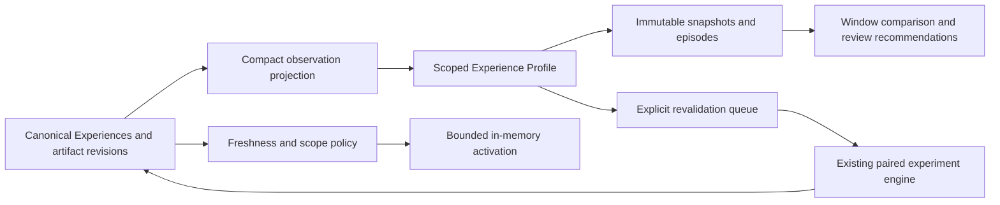
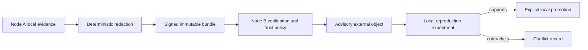
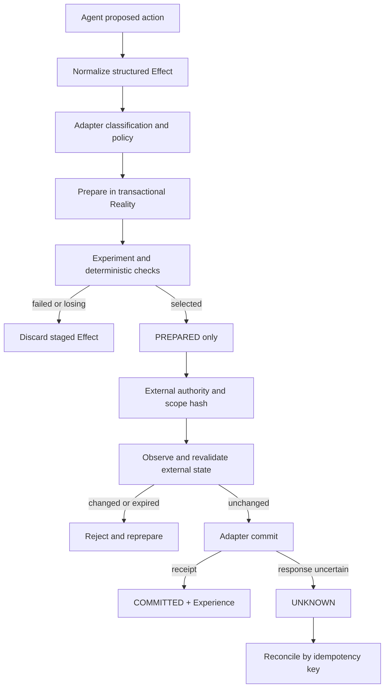

# Architecture

## V0.5 curriculum and Experience Packages

```text
                     AGENT
                       |
                     SKILL
                       |
                Experience Package
                       |
              Deterministic Planner
                  /    |    \
              Trial A  B  Trial C
                PASS FAIL DEGRADED
                  \    |    /
                    Evidence
                  /    |    \
              Lesson Reflex Recovery
                  \    |    /
              Operating Envelope
                       |
             Coverage + Maturity Policy
```

`curriculum::{catalog,inventory,planner,policy}` builds explicit plans from immutable Experiences, existing Skills, versioned Lessons/responses, sparse envelopes, contradictory contexts and exact trial history. The executor dispatches to V0.4 strategy experiments for base/context revalidation, V0.2 chaos campaigns for condition/control pairs, and the existing resilience engine for paired recovery/reflex tests. It does not introduce another process runner.

The outer executor owns aggregate reservations, a monotonic cancellation deadline and a one-executor lease. Controls and paired arms count. At most two planning rounds are supported; round two can only validate a newly proposed Recovery. Shared provider slots coordinate curriculum work with V0.4 experiments. Every selected trial has a persisted reason, fingerprint, policy decision, cost and engine reference.

Migration 008 adds curriculum plans/goals/trials/gaps, events, engine links, explicit task families, derived skill usage/coverage, immutable package snapshots and review records. Original Skill rows remain immutable. Reads enrich them from the latest package snapshot; neither old Experience JSON nor the registered procedure is rewritten. Trial results refer to existing evidence, not copied Execution or Experiment records. Historical package item versions preserve provenance.

The Bridge's bounded experiment worker also accepts explicit curriculum jobs. Planning and starting are separate requests, disabled for agents by default. Session ownership and cumulative trial reservations are checked; only verified bundled hardening procedures in the requesting repository are admitted from agents. No background scheduler or MCP server is added. See [curriculum semantics](curriculum.md) and the [V0.5 report](implementation-v05.md).

## V0.4 experience on demand

```text
                         AGENT
                           |
              +------------+------------+
              |                         |
          known path                uncertainty
              |                         |
            action              ExperimentRequest
              |                         |
              |                 budget + capacity
              |                         |
              |              equivalent-start barrier
              |                   /           \
              |               Reality A    Reality B
              |                   |           |
              |               candidate A  candidate B
              |                   |           |
              |                   +-----+-----+
              |                         |
              |                  evaluate + compare
              |                         |
              +------ agent decides <---+ evidence
```

`budget` holds the shared resource model and strict admission policy. `experimentation::{model,config,orchestrator,comparison}` adds strategy requests without replacing the existing lesson or chaos semantics. The orchestrator uses the existing Git provider and `workflow::run_prepared_trial`; original runs, counterfactuals, chaos, and strategy candidates share execution, evaluation, artifact capture and immutable Experience insertion. The concrete borrowed Store/provider design is retained because the SQLite connection is not Sync and the existing async traits are not object-safe.

All candidate Realities acquire provider/Reality leases and pass verification before any starts. Bounded worker threads each own a SQLite connection and current-thread Tokio runtime. The Bridge's bounded experiment queue is separate from its cached action handler and recording worker. Progress is durable cursor-based data. Cancellation is sticky and joins launched workers rather than dropping their futures; pending candidates are discarded without claiming execution.

The new `ExperimentStore` trait persists requests, queryable candidate results, variables, lineage and progress. Candidate Experiences include immutable experiment/candidate/fingerprint provenance. Comparison is evaluator-first, with optional explicit secondary metrics and qualitative evidence weighting. Reflection can propose a Candidate Lesson only for a completed controlled failing/passing pair; it cannot promote the Lesson. See [quality](experiment-quality.md).

This phase does not add MCP, Docker, external-effect rollback, live process snapshots, automatic adoption, or a second vendor-specific experiment engine. Native context teaches the shared helper and discloses recorded-commit fallback. The [agent experiment guide](agent-experiments.md) specifies the measured equivalence and safety boundaries.

## V0.3 integration boundary

Four thin adapters communicate through one authenticated [local JSONL Bridge](bridge-protocol.md). Native code does not access SQLite or domain repositories. The existing modular crate is retained; `bridge::{protocol,transport,engine,cache,recording,privacy,config}` separates the public contract, session state, action decisions, and asynchronous evidence work. `integrations::{claude,codex,install}` and the Python/TypeScript plugin packages translate host events.

The action path uses an in-memory lesson/reflex snapshot, exact scoped matches, and a bounded persistence queue. The learning worker captures normalized history and tracked diffs, runs locally configured checks, and commits observed Reality, execution, Experience, applications, and the completed run atomically. Acknowledged telemetry is queued, not fsynced. No model call, reflection, or experiment runs in a pre-tool callback.

Native workspaces are `Observed` Realities, never owned/deleted by Hardknock. Only the existing Git `RealityProvider` creates/disposes controlled experiment worktrees. A clean native Git baseline and completed action can support an explicit paired controlled reconstruction, labeled separately from replay of an inherited environment. See [provenance and validation](agent-experience-contract.md).

Learning decisions are advisory. Only explicit local policy may block or require native approval. Codex item-start notifications cannot intercept execution. Every adapter has a documented visibility boundary; successful live demonstrations with two agents remain pending in the [phase report](implementation-v03.md).

## Implemented: empirical transfer and local resilience

One modular Rust crate runs the local empirical loop. Reflection proposes a hypothesis; recorded trials supply counterfactual evidence. Scoped retrieval can advise a future run, and observed successful application in a distinct repository tree can validate a supported Lesson.

```text
                   Agent
                     │
               Agent Adapter
                     │
                  Reality
                     │
                 Execution
                     │
                 Evaluation
                     │
                 Experience (immutable)
                     │
                  Reflection
                     │
             Candidate Hypothesis
                     │
              Candidate Lesson
                     │
        Counterfactual Experiment
              /              \
         baseline         alternative
           FAIL               PASS
              \              /
                   Evidence
                     │
       Counterfactually Supported Lesson
                     │
             Scoped Retrieval
                     │
          Context → Agent → Application
                     │
             New Experience
                     │
       Distinct observed success → Validated
```

| Module | Responsibility |
| --- | --- |
| `core` | Typed IDs, state references, Realities, process observations, artifact types |
| `dojo` | `RealityProvider`; detached Git worktrees, starting-state verification, diff, disposal |
| `agent` | `AgentAdapter`; literal argv template parsing for opaque CLIs |
| `process`, `cancellation` | Unix process groups, deadlines, file capture, sticky cancellation |
| `evaluation` | Async `Evaluator`, `CommandEvaluator`, required check results |
| `experience` | Immutable evidence, bounded failure signatures, context and environment fingerprints |
| `workflow` | Shared run → evaluate → persist → cleanup lifecycle for original runs and trials |
| `reflection` | `ReflectionProvider`, deterministic fixture rule, manual hypotheses |
| `lesson` | Scope and action matching, evidence relationships, guarded lifecycle, confidence policy |
| `experiment` | Explicit replay plan, fresh baseline/alternative runs, comparison policy |
| `budget`, `experimentation` | Structured on-demand requests, strict caps, common-start proofs, bounded candidates, comparison quality and lineage |
| `bridge::experiments`, `cli::experimentation` | Shared native request/progress/result service and `try`/replay/cancel/export UX |
| `retrieval` | Stable QueryContext, hard scope gates, deterministic scoring and thresholds |
| `application` | Advice files, optional progress observer, fixture traces, opaque usage reports, repeated mistakes |
| `learning_loop` | Opt-in retry budget, fresh original state, immutable retry lineage |
| `validation` | Distinct successful application policy, deduplication, recorded decisions |
| `explanation` | Historical application snapshot, current Lesson, source and experiment chain |
| `store` | SQLite migrations, typed store traits, immutable records, revisions, provenance keys |
| `perturbation` | Typed local conditions, reversible Reality handles, child environment inputs |
| `resilience` | Campaigns, fixture lifecycle, scoped Reflex matcher, paired tests, recovery and envelope models |
| `cli` | Parsing, adapter selection, human/JSON presentation; no conclusion or confidence rules |

SQLite is bundled through `rusqlite`. Tokio handles subprocess waits and cancellation. No service, model API, or additional runtime is needed for the fixture.

## State and environment equivalence

`StateRef` contains a canonical repository path, full commit ID, and full tree ID. Initial capture rejects unborn, bare, dirty, and submodule repositories. Forking recreates the recorded commit, even after the parent changes or is discarded. Ignored files are not copied or included in diffs.

Every run verifies the new worktree's HEAD and compares its files against the recorded snapshot before executing commands. Diff collection uses a temporary Git index, includes tracked and nonignored new files, and does not rewrite the agent's index. Hooks and filesystem-monitor hooks are disabled for Hardknock's own Git commands. Repository filters and other shared Git configuration can still affect checkout; a resulting content mismatch is rejected.

Opaque `--agent-command` runs inherit the caller's environment and cannot be replayed automatically. `--script`, the test adapter, and trials clear the inherited environment and set a small fixed environment. The recorded fingerprint covers that policy, OS, architecture, and the BLAKE3 digest of `/bin/sh`; per-Reality HOME/PWD paths are normalized. Both trial worktrees are verified before execution, and their fingerprints must match the source Experience. See [experimental limits](experiments.md#equivalence-and-limits).

## Evaluation and persistence lifecycle

1. Validate input and acquire an advisory Reality lease before worktree creation.
2. Reconstruct and verify the starting snapshot; collect context before any task effects.
3. Optionally retrieve scoped Lessons, snapshot context files, and notify the CLI before starting the agent. Run with stdin closed, file outputs, and a deadline.
4. Stop its process group, save its diff, persist an immutable `ExecutionRecord`, and observe application before checks can change the report.
5. Run required checks sequentially in the same Reality. Ordinary check failure does not skip later checks; cancellation or timeout does.
6. Save the final diff including evaluator effects, hash artifacts, and atomically insert Evaluation, Experience, application/lineage/mistake rows, and any evidence-based Lesson revision and validation decision.
7. Discard the Reality unless kept or required to preserve evidence after a capture/storage error.

Process success and task success are independent. A failed process can still satisfy all required checks; an exit-zero process can fail evaluation. No checks means an inconclusive task observation; the CLI retains its old process-based exit behavior for compatibility.

Experiments persist their plan before running trials. Each trial records its own immutable Experience and artifact links. Finishing a successful comparison commits the terminal Experiment, evidence relationships, and next Lesson revision in one immediate SQLite transaction. It loads the latest Lesson revision so concurrent experiments do not overwrite each other's evidence. Failed/interrupted investigations retain completed trials without promoting a Lesson.

Application transactions likewise acquire an immediate write transaction before loading the latest Lesson and evidence summary. Concurrent applications retain both observations while deduplicating the same tree/fingerprint for confidence. Each application references the exact immutable Lesson version that was delivered, even if another run revises or retires it before completion. Retired Lessons are not promoted by late application writes.

The adapter API remains compatible: context preparation wraps command execution rather than replacing `build_command(task)`. An optional advice observer reports progress. Generic reports are self-reported, while trusted fixture traces provide observed influence. See [retrieval](retrieval.md) and [agent integration](agent-integration.md).

## Data and migration boundaries

| Migration | Contents |
| --- | --- |
| `001_substrate.sql` | Existing Realities and append-only Executions; unchanged |
| `002_experiences.sql` | Evaluations, immutable Experiences, typed artifact references |
| `003_learning.sql` | Hypotheses, Lessons, immutable revisions, Experiments, Trials, evidence and artifact links |
| `004_transfer.sql` | Immutable applications/artifact links, Experience relations, repeated mistakes, validation decisions |
| `005_resilience.sql` | Perturbations, campaigns/trials, envelopes, Skills, Reflex/Recovery revisions, matches/attempts, paired tests and provenance |
| `006_bridge.sql` | Native sessions, telemetry, completed runs, feedback and revalidation flags |
| `007_agent_experiments.sql` | Immutable structured requests, candidates/results, variables, relations, progress and candidate-Experience uniqueness |
| `008_curriculum.sql` | Bounded curricula, goals/trials, task families, evidence gaps, Skill coverage/usage and package snapshots |
| `009_development.sql` | Compact canonical observation view, derived profiles, immutable snapshots/episodes, Skill/package revisions, revalidation, regressions and benchmark records |

Foreign keys represent Lesson → source Experience/Hypothesis, Experiment → Lesson/Hypothesis/source, Trial → Experiment/Reality/Execution/Evaluation/Experience, and Trial → artifacts. Store validation checks the structured records agree with these links. Triggers reject updates/deletes of immutable history. Terminal experiments cannot be rewritten. Lessons use checked versions; updates preserve creation time and existing evidence. Changing the tested claim, scope, or commands requires a new hypothesis; a rationale can be revised through the store API.

Migrations are transactional and applied once. Migration 005 rebuilds the relation/evidence tables to extend their allowed values, preserving every row and reestablishing immutable triggers. Other additions introduce new tables. Existing Execution/Experience/Lesson JSON is not rewritten. New Experience collections default empty and new Lesson lifecycle fields default absent. Old artifact references default to kind `other`, and old commands to inherited environment. Unknown newer schemas are rejected. Migration 009 backfills Skill revision 1 from existing records; it does not promote evidence or broaden scope. There is no destructive down migration; restore a backup to run an older binary.

## Retention, cancellation, and crashes

A shared cancellation token stays set throughout the command. SIGINT/SIGTERM stops the active process group; pending checks/trials/retries are skipped. Ordinary background descendants are also stopped when the parent exits. The runner uses SIGKILL, not graceful shutdown hooks. Processes that establish new sessions/process groups may escape.

Normal success, check failure, timeout, and cancellation retain evidence and discard trial worktrees. The older run/counterfactual paths preserve the affected worktree after capture/storage failures and report its path. V0.4 disposable strategy trials attempt cleanup even after capture failures, retain available raw artifacts/executions, and refuse a valid comparison if an Experience cannot be completed. Earlier trial evidence remains queryable. Pre-execution verification failures clean up without starting a child.

`reality cleanup` only removes unlocked automatic-run worktrees. It leaves manual/kept/capture-failure Realities alone, and rechecks paths after taking a lease. It never prunes arbitrary Git worktrees. Stop abandoned processes before cleanup: a released lease is not proof that all descendants stopped.

SIGKILL or power loss can leave a running Experiment and an orphan worktree. `experiment list/show` exposes the plan and persisted partial trials; `reality list/cleanup` provides inspection and cleanup. Automatic resumption/reconciliation is deferred. Filesystem and SQLite writes are not a single transaction.

## Safety boundary

**Git worktrees are not secure sandboxes.** Host files, processes, network, Git objects/refs/configuration, and externally accessible credentials remain shared. Clearing environment variables and moving HOME for scripted trials does not prevent access to the user's real home or credentials through other paths. Commands can modify the source repository or perform external effects that Hardknock cannot roll back.

Use trusted scripts on disposable tasks. Warnings appear before execution and are not hidden by quiet mode. Arguments, tasks, diffs, and logs can contain secrets; there is no general redaction or disk quota. Raw environment secrets are not copied into records. Data directories are private to the current OS user, not authenticated storage or an enforcement policy.

Linux and macOS are supported targets; Windows, containers, and remote workers remain deferred. Native vendor adapter status is documented in [integrations](integrations.md).

## V0.2 resilience layer

The shared workflow verifies a fresh Reality, captures context, applies scoped perturbation handles, runs the deterministic lifecycle (or top-level shell Command), evaluates, and commits immutable Experience evidence. It captures diffs before reversing perturbations and disposing of the Reality. Every fixture operation has a real ActionRecord and hashed logs. Runtime environment overrides are explicit in commands and perturbation records, not hidden host mutations.

Campaigns require a healthy unperturbed control. Trial rows commit with Experiences; inspection reconstructs partial trial lists from those rows. Finished campaigns create immutable sparse envelopes. Candidate Lessons remain unpromoted by chaos alone. Reflex and Recovery tests produce paired Experiences and commit the test conclusion plus the latest object revision in an immediate transaction. Concurrent tests retain all evidence. This resilience runtime matches at fixture hooks. V0.3 also matches supported/active rules through the Bridge; opaque generic runners remain unaffected.

See [chaos](chaos.md) for limits/JSON/budgets, [operating envelopes](operating-envelopes.md) for point semantics, [reflexes](reflexes.md) for activation/false positives, and [recovery](recovery.md) for failure-state reproduction. Host crashes may leave running campaigns/tests; automatic reconciliation and resumption remain deferred.

## V0.6 development projections

`development::{model,profile,policy}` builds scoped profiles in a consistent SQLite read transaction. The compact `development_observations` view reads canonical Experience JSON without deserializing raw action logs. Snapshots store metric denominators, policy/configuration hashes and evidence IDs. Profile cache rows are disposable; snapshots, episodes and revisions are retained. Skill revision 1 is backfilled without rewriting original Skill/Experience rows. Package generation and legacy package snapshot writes are separate transactions; generation can be retried if interrupted between them.



Cold retrieval reads only linked source/support observations for freshness; cache loading also resolves Reflex support once. Pre-tool decisions never query the store. Optional development context is assembled during session/context requests, outside the session mutex, and obeys the existing serialized byte budget. Broader local profile aggregation does not widen an artifact's selector or turn evidence into user policy.

`development::benchmark` runs three isolated fixture arms through existing execution, experiment, curriculum and recovery engines. Task and training evidence remain distinguishable. Each terminal result contains run configuration, source trees, agent versions, per-episode metrics and learning-curve Experience IDs. See [development semantics](development.md) and the [V0.6 report](implementation-v06.md).

## V0.7 federation boundary

Federation exchanges signed, content-addressed experience bundles between independently operated nodes. A bundle crosses an explicit trust boundary: signature verification proves which node key produced the bytes, while local reproduction determines whether its claims transfer to the receiving context. Imported Lessons, Skills, and Reflexes remain advisory until local evidence supports promotion. External Reflexes can request `BLOCK`, but import constrains their effective behavior to `ADVISE`.



The first transport is a local filesystem repository. It never pushes Git state or performs network I/O. Provenance retains the original producer and lineage through re-export; duplicate detection uses content and lineage identifiers. See [federation](federation.md) and the [V0.7 report](implementation-v07.md).

## V0.8 effect boundary



`effects` materializes current state; `effect_events` is the append-only canonical lifecycle. Realities reference ledgers. Prepared records retain previews and before-state snapshots. Authorizations bind exact scopes. Receipts, compensation receipts, reconciliation attempts, group outcomes, and Effect-to-Experience links preserve the evidence chain.

The mock external system is deliberately separate from the main ledger database. Its resource mutation and idempotency record commit in one local SQLite transaction. This proves adapter semantics without claiming arbitrary external systems share those guarantees. See [transactional Realities](transactional-realities.md), [commit semantics](commit-semantics.md), and the [V0.8 report](implementation-v08.md).
