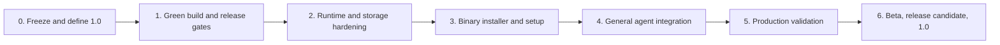

# Hardknock Production Readiness and Agent Installation Plan

_Audit date: September 25, 2026_

## Overall verdict

Hardknock is a strong research-grade implementation and a credible controlled
pilot. It is not ready for general production installation.

The evidence and safety semantics are unusually well developed: the repository
contains broad deterministic coverage, explicit trust boundaries, conservative
promotion rules, immutable history, bounded experiments, and a working local
Bridge. The remaining work is mainly product engineering: a supported product
boundary, reproducible release gates, reliable process and daemon lifecycle,
storage operations, compatibility testing, binary distribution, and one
machine-readable setup path.

Feature development has outpaced productization. The next release should freeze
V0.23+ work and make the existing local system installable, operable, and
supportable.

| Area | Verdict | Audit evidence |
| --- | --- | --- |
| Knowledge and experiment architecture | Strong | Typed evidence, explicit scope, conservative trust, 30 append-only migrations, and broad fixture coverage |
| Deterministic test coverage | Strong but the release gate is not green | A full serial retry passed 459 tests with zero failures and five ignored manual/optional tests; the preceding full run failed once in Ctrl-C cleanup |
| Process reliability | Needs hardening | One full serial run observed a surviving background descendant after Ctrl-C; the isolated rerun and full retry passed, indicating a timing-sensitive cleanup path |
| Build reproducibility | Blocked | The documented Clippy command fails on the current stable toolchain because of an unknown suppressed lint; it passes only when `unknown-lints` is explicitly allowed |
| Storage operations | Incomplete | Schema migration reaches 30, while `hardknock doctor` reports schema 20; backup, restore, retention, quotas, and crash reconciliation are incomplete |
| Release and packaging | Missing | `Cargo.toml` remains `0.17.0-dev.1`, `publish = false`, and no tracked CI or release workflow exists |
| Installation | Prototype quality | Source installation works but requires Rust and installs `hardknock-test-adapter` alongside the two product binaries |
| Native integrations | Promising but brittle | Fixture adapters work; live acceptance is incomplete; the installed Codex 0.154 build is rejected because fixtures target 0.149.1 |
| Operations | Incomplete | The detached Bridge has no system service integration and discards daemon stdout/stderr; operator logs, rotation, upgrade, and repair flows are absent |
| Documentation | Extensive but inconsistent | The README describes V0.22 work while package metadata and the roadmap status header still describe V0.17/V0.18 |

## Supported 1.0 boundary

Hardknock 1.0 should support:

- one operating-system user on a developer workstation or dedicated CI runner;
- Linux and macOS on x86-64 and ARM64;
- local SQLite state with verified backup, restore, migration, and retention;
- trusted-host execution and an explicitly selected container provider for
  unattended or higher-risk agent commands;
- generic noninteractive agents through a stable CLI and MCP stdio adapter;
- richer lifecycle integrations for Claude Code and Codex, with Hermes and
  OpenClaw supported when their live conformance gates pass;
- local authenticated Bridge operation and signed, operator-configured
  filesystem synchronization.

The following remain experimental or post-1.0:

- hosted or multi-tenant operation;
- remote HTTP Bridge exposure;
- automatic continuous learning;
- production Effect adapters and unattended external commits;
- general network-distributed synchronization and discovery;
- Windows support;
- claims of microVM or hostile multi-tenant isolation;
- automatic activation of remote knowledge or agent-granted approval.

Existing advanced commands may remain available, but each must report a stable,
beta, or experimental maturity level. Experimental features must require an
explicit opt-in and must not be enabled by `setup`.

## Plan constraints

- Preserve the distinctions among execution, evaluation, Experience, Lesson,
  policy, capability, and external authority.
- Keep agent self-approval impossible and keep Effect commit outside generic
  agent integration.
- Add migrations for schema changes; do not rewrite released migration files or
  silently reinterpret existing evidence.
- Keep setup, upgrade, repair, pruning, and uninstall inspectable and
  non-destructive by default.
- Do not weaken fail-closed trust, scope, signature, replay, or capability checks
  to improve compatibility.
- Do not add V0.23+ product features until the required build, storage,
  installation, and live-integration gates pass.
- Require each implementation tranche to list every touched path, migration,
  compatibility effect, and binary acceptance test before work begins.

## Target installation experience

An end user should not need Rust or a repository checkout:

```bash
install-hardknock --version <version>
hardknock setup --agent auto --start
hardknock doctor --strict
```

An autonomous installer should use the same workflow without prompts:

```bash
hardknock setup \
  --agent auto \
  --mode workstation \
  --non-interactive \
  --json

hardknock integrate doctor --strict --json
hardknock integration manifest --json
```

The installer and setup command must:

1. detect the platform and architecture;
2. download a pinned release artifact and verify its checksum and provenance;
3. install only `hardknock` and `hk-effect` into an explicit prefix;
4. create or validate a private Hardknock home;
5. inspect detected agents and produce an installation plan;
6. apply only managed adapter changes;
7. install or start the Bridge through `launchd`, `systemd --user`, or the
   documented on-demand fallback;
8. run strict health and compatibility checks;
9. emit stable JSON describing every change, warning, and next action;
10. support idempotent reruns, `--dry-run`, repair, upgrade, and non-destructive
    uninstall.

## Delivery sequence



### Phase 0: freeze scope and align the product

Goal: create one authoritative statement of what the current product supports.

Work:

- Align `Cargo.toml`, `README.md`, `docs/README.md`, `docs/roadmap.md`, CLI
  version output, protocol versions, and implementation status.
- Use one product version source. Treat migration and wire schema versions as
  separate compatibility numbers.
- Publish a support matrix for operating systems, architectures, container
  runtimes, agents, and storage modes.
- Label every major command family stable, beta, or experimental.
- Add `CHANGELOG.md`, `SECURITY.md`, and `docs/support-policy.md`.
- Stop V0.23+ feature work until the 1.0 release gates are met.

Acceptance criteria:

- [ ] Every public status document names the same current release and maturity.
- [ ] `hardknock --version`, release tags, artifacts, and package metadata match.
- [ ] Stable, beta, experimental, and unsupported surfaces are machine-readable.
- [ ] The 1.0 non-goals above are documented and reflected in defaults.

### Phase 1: make every build and release reproducible

Goal: turn the current source tree into verified release artifacts.

Work:

- Fix the unknown Clippy lint and establish a measured minimum supported Rust
  version plus a pinned release toolchain.
- Test both the minimum toolchain and current stable Rust.
- Restore CI for formatting, Clippy, unit/integration tests, documentation,
  package contents, migration compatibility, and install smoke tests.
- Add release builds for:
  - `x86_64-unknown-linux-gnu`
  - `aarch64-unknown-linux-gnu`
  - `x86_64-apple-darwin`
  - `aarch64-apple-darwin`
- Declare product binaries explicitly so normal installation excludes
  `hardknock-test-adapter`.
- Produce archives, checksums, a software bill of materials, dependency license
  inventory, and signed build provenance.
- Add dependency vulnerability and license-policy checks.
- Verify the release archive on fresh Linux and macOS runners before publishing.

Primary files:

- `Cargo.toml`
- `rust-toolchain.toml`
- `src/capability/token.rs`
- `.github/workflows/ci.yml`
- `.github/workflows/release.yml`
- `deny.toml`
- `CHANGELOG.md`
- `NOTICE`

Acceptance criteria:

- [ ] `cargo fmt --all --check` passes.
- [ ] `cargo clippy --locked --all-targets --all-features -- -D warnings` passes
      without lint exceptions supplied by CI.
- [ ] The full serial suite passes twice on every supported operating-system
      family.
- [ ] A release archive installs and runs without Rust installed.
- [ ] Release installation contains `hardknock` and `hk-effect`, with test
      utilities distributed separately.
- [ ] Every artifact has a verified checksum and build attestation.

### Phase 2: harden runtime, storage, and daemon operations

Goal: ensure interruption, upgrade, resource pressure, and restart have
predictable outcomes.

Work:

- Replace duplicated schema numbers with one `LATEST_SCHEMA_VERSION` constant
  used by migration, doctor, diagnostics, tests, and release metadata.
- Add `hardknock backup`, `hardknock restore --verify`, and migration dry-run
  support. Create a verified backup automatically before a schema upgrade.
- Test upgrades from representative historical database snapshots and verify
  that the prior binary can recover through the backup.
- Add artifact retention policies, byte/count quotas, dry-run pruning, and
  protected evidence rules.
- Reconcile stale running sessions, experiments, leases, worktrees, containers,
  sockets, and temporary evaluator output on startup.
- Harden process-tree termination across Linux and macOS. Replace the current
  timing-sensitive assertion with a repeatable stress test and retain a
  deterministic regression case.
- Give the Bridge durable structured logs, rotation, health state, and clean
  shutdown. Do not discard daemon diagnostics.
- Add user service definitions for `launchd` and `systemd --user`.
- Extend `doctor --strict` to check schema truth, filesystem permissions,
  available disk, stale resources, release integrity, Bridge liveness, adapter
  compatibility, and backup status.

Primary files:

- `src/store.rs`
- `src/cli/development.rs`
- `src/process.rs`
- `src/cancellation.rs`
- `src/bridge/transport.rs`
- `src/cli/integrations.rs`
- `tests/cli.rs`
- `tests/agent_experiments.rs`
- `tests/substrate.rs`
- `tests/bridge.rs`

Acceptance criteria:

- [ ] Doctor reports schema 30 for the current database and reads the value from
      the shared schema registry.
- [ ] Backup/restore round trips preserve database integrity and referenced
      artifacts.
- [ ] Upgrade failure leaves the previous home recoverable.
- [ ] At least 100 consecutive cancellation/process-tree stress iterations pass
      on Linux and macOS.
- [ ] A 24-hour Bridge soak has no leaked processes, sockets, worktrees, or
      unbounded logs.
- [ ] Quota exhaustion produces a bounded, actionable error without deleting
      protected evidence.

### Phase 3: ship a safe binary installer and transactional setup

Goal: reduce installation to one download and one setup command.

Work:

- Add a small version-pinned bootstrap installer with:
  `--version`, `--prefix`, `--no-modify-path`, `--dry-run`, `--json`, and
  `--uninstall`.
- Add `hardknock setup`, `upgrade`, `repair`, and managed `uninstall` commands.
- Make setup produce a plan before mutation and journal every applied step so a
  failed setup can roll back its own changes.
- Preserve existing agent configuration and refuse symlink, ownership, or
  unmanaged-file ambiguity.
- Detect Claude Code, Codex, Hermes, OpenClaw, Docker/Podman, Git, and service
  manager availability.
- Install adapters only when requested or selected by `--agent auto`.
- Use a stable binary path in hook/plugin configuration so an in-place upgrade
  does not leave stale executable references.
- Add fresh-machine install, upgrade, downgrade-recovery, repair, and uninstall
  fixtures.

Primary files:

- `src/cli.rs`
- `src/cli/integrations.rs`
- `src/integrations/install.rs`
- `tests/integrations.rs`
- `scripts/install.sh`
- `packaging/systemd/hardknock-bridge.service`
- `packaging/launchd/dev.openkedge.hardknock.bridge.plist`

Acceptance criteria:

- [ ] A fresh supported host reaches a passing strict doctor without a Rust
      toolchain.
- [ ] Repeating setup makes no duplicate hooks, plugins, services, or config.
- [ ] `--dry-run --json` fully describes planned filesystem and configuration
      changes.
- [ ] Failed setup restores every file it changed.
- [ ] Uninstall removes only managed files and preserves the data home unless
      the user separately requests data removal.
- [ ] Upgrade keeps configuration, creates a backup, migrates once, and verifies
      adapter health.

### Phase 4: make integration portable across agentic systems

Goal: provide one generic integration contract while retaining richer native
adapters.

Work:

- Add `hardknock mcp serve --stdio` as a facade over the existing Bridge/domain
  APIs. The first stable surface should expose:
  - `hardknock_query_context`
  - `hardknock_record_outcome`
  - `hardknock_request_experiment`
  - `hardknock_experiment_status`
- Keep commit, compensation, approval, arbitrary filesystem access, and
  unrestricted command execution out of the MCP surface.
- Add `hardknock integration manifest --json` for systems that install tools
  from machine-readable command, environment, healthcheck, transport, schema,
  and capability metadata.
- Add a conformance harness that any adapter can run without a model call.
- Replace exact Codex-version pinning as the primary gate with protocol/schema
  capability detection, a supported version range, and tested-version warnings.
  Required fields and unsafe semantic changes must still fail closed.
- Run live disposable acceptance for:
  - the generic MCP stdio adapter;
  - current Claude Code;
  - current Codex;
  - Hermes and OpenClaw before labeling those adapters stable.
- Publish a compatibility matrix generated from CI and live conformance results.

Primary files:

- `src/bridge/protocol.rs`
- `src/bridge/transport.rs`
- `src/integrations/codex.rs`
- `src/integrations/install.rs`
- `src/cli/integrations.rs`
- `src/mcp/`
- `tests/integrations.rs`
- `tests/mcp.rs`
- `docs/agent-experience-contract.md`
- `docs/integrations.md`

Acceptance criteria:

- [ ] A generic MCP-capable agent can retrieve scoped context, report an
      observable outcome, and request a bounded experiment.
- [ ] The MCP adapter cannot commit an Effect or grant approval.
- [ ] The integration manifest is versioned, JSON-schema validated, and stable
      across patch releases.
- [ ] Current Claude Code and Codex complete an evaluated disposable task and
      record a second-agent transfer case.
- [ ] An unknown but schema-compatible agent version produces a warning and a
      conformance result rather than an unconditional version rejection.

### Phase 5: validate the supported production boundary

Goal: replace fixture-only confidence with host and upgrade evidence.

Work:

- Run the container security suite on rootless Docker and Podman hosts, including
  filesystem, network, credential, resource-limit, cancellation, and cleanup
  checks.
- Feature-gate or retain experimental labeling for integrations that lack live
  provider validation, including PostgreSQL effects.
- Fuzz public JSON, JSONL, sync-envelope, and configuration parsers.
- Add property tests for immutable history, idempotency, replay rejection,
  authorization scope, and migration invariants.
- Run load and soak tests for Bridge session limits, queue saturation, large
  stores, retention, and repeated restart.
- Perform a focused security review of installer ownership, update integrity,
  local token handling, plugin trust, archive extraction, and symlink races.
- Rehearse key compromise, backup restore, failed upgrade, corrupted database,
  full disk, killed daemon, stale socket, and interrupted setup.

Acceptance criteria:

- [ ] Every security claim in the stable support matrix has live evidence on at
      least one supported provider per operating-system family.
- [ ] No unresolved critical or high dependency advisory affects the default
      product.
- [ ] Parser fuzzing completes its release budget without a crash.
- [ ] The supported load limit and failure behavior are documented and enforced.
- [ ] Recovery drills succeed using public commands and published documentation.

### Phase 6: beta, release candidate, and 1.0

Goal: prove that someone other than the repository author can install, operate,
upgrade, and recover Hardknock.

Work:

- Release `0.22.0-beta.1` after phases 0–3.
- Run a bounded beta with fresh workstations and CI runners using the generic
  adapter plus at least Claude Code and Codex.
- Resolve every P0/P1 beta defect and repeat install/upgrade/restore drills.
- Publish a release candidate with frozen schemas and a documented compatibility
  window.
- Publish 1.0 only after all gates below pass.

## 1.0 release gates

- [ ] Fresh binary install on all supported platform/architecture pairs.
- [ ] One noninteractive setup command reaches a passing strict doctor.
- [ ] Full required CI matrix is green from a clean checkout.
- [ ] Cancellation stress and Bridge soak gates pass.
- [ ] Database backup, migration, restore, and N-1 upgrade rehearsal pass.
- [ ] Generic MCP plus current Claude Code and Codex live acceptance pass.
- [ ] Stable protocol, integration manifest, config, and database compatibility
      policies are published.
- [ ] Release artifacts include checksums, provenance, SBOM, licenses, and a
      changelog.
- [ ] Security and support contacts, response expectations, and supported
      boundaries are public.
- [ ] Stable defaults cannot grant Effect commit authority, agent self-approval,
      remote-knowledge activation, or autonomous continuous learning.
- [ ] Experimental commands are visibly labeled and require explicit opt-in.

## First implementation tranche

The first tranche should be small enough to review as a series of focused
changes:

1. Fix version and schema truth:
   `Cargo.toml`, `src/store.rs`, `src/cli/development.rs`, status docs, and tests.
2. Make the existing gate green:
   remove the obsolete Clippy suppression and stabilize cancellation cleanup.
3. Restore CI and add release/install smoke tests.
4. Restrict normal installation to the two product binaries.
5. Add backup/restore and strict doctor checks.
6. Add the setup plan/apply journal before writing the public bootstrap script.

This tranche creates the foundation for the installer and portable agent
adapter without changing Hardknock's learning semantics.

## Rough effort

For the scoped single-user/CI 1.0 boundary, the plan is approximately 10–14
engineer-weeks, depending on cross-platform process cleanup and live adapter
compatibility. Hosted multi-user operation, network sync, production Effect
adapters, or stronger-than-container isolation would be separate programs.

## References

- [Architecture](architecture.md)
- [Threat model](threat-model.md)
- [Bridge protocol](bridge-protocol.md)
- [Agent integrations](integrations.md)
- [V0.22 progress](v0.22-progress.md)
- [Roadmap](roadmap.md)
