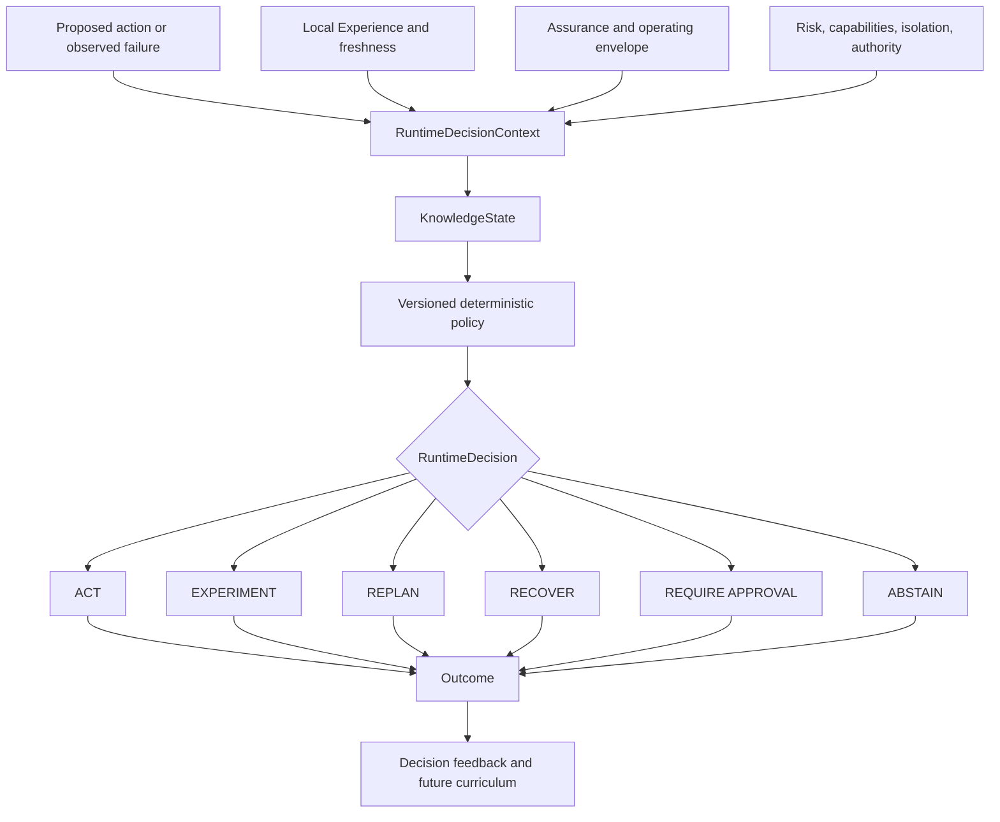

# Adaptive runtime control

Hardknock V0.12 uses accumulated empirical evidence while an agent is working. The deterministic controller answers one bounded question:

> Given the current context, applicable evidence, uncertainty, risk, and authority, what should happen next?

It does not replace the agent's planner or the security boundary. It turns evidence into one of six structured control decisions.

| Decision | Meaning |
| --- | --- |
| `ACT` | Proceed through ordinary capability and Effect enforcement, optionally with a warning or narrower assured tool |
| `EXPERIMENT` | Resolve a consequential uncertainty in a bounded Reality under an explicit budget |
| `REPLAN` | Do not continue with the proposed strategy unchanged |
| `RECOVER` | A fresh, scoped Recovery matches the observed failure signature |
| `REQUIRE_APPROVAL` | Evidence supports preparation, but an external authority must authorize the consequential action |
| `ABSTAIN` | Evidence, isolation, an Effect adapter, or a safe experiment is insufficient; do not guess |

`REPLAN` is not a security block. `REQUIRE_APPROVAL` is not an assurance failure. `ABSTAIN` is not a generic refusal. Each has a separate typed payload and audit event.

## Control path



The synchronous Bridge path reads its hot cache, classifies context, evaluates policy, and enqueues the immutable decision record. It performs no database lookup and no model call before returning guidance. The CLI and direct-run synthesis paths may query SQLite for current Lessons, Skills, Reflexes, Recoveries, certifications, and envelopes before evaluating the same controller.

## Decision context

`RuntimeDecisionContext` captures the complete decision input:

- stable Hardknock session, agent, task, and `QueryContext`;
- proposed normalized action and optional structured `EffectRequest`;
- relevant Lessons, Reflexes, Recoveries, applicable Skills, and known unknowns;
- certification summary, applicability, requirements, and evidence gaps;
- operating-envelope position;
- available and missing capabilities, isolation, Effect adapter support, governance, and commit authority;
- dimensional severity, reversibility, externality, and Effect risk;
- explicit uncertainty and candidate strategies;
- bounded experiment capability and candidate tool summaries.

The context has a stable BLAKE3 hash. The stored hash, session, decision, evaluation, and policy version are checked again before persistence. Decision rows, reasons, evidence links, policy versions, abstentions, and control events are append-only.

## Knowledge states

`KnownSupported` requires applicable local support, compatible scope, acceptable freshness, and no material contradiction or known gap. A retrieval match alone is not enough.

`KnownContradicted` means compatible local support and material contradictory evidence coexist. Balanced policy favors a controlled experiment when one is safe.

`KnownStale` means supporting evidence exists but current context or freshness policy requires revalidation. Stale recovery evidence is experimented on before use when possible.

`Unknown` means applicable empirical support is insufficient. Unknown is allowed for low-risk reversible work, investigated for consequential testable work, and preserved as unknown when neither assurance nor a safe experiment exists.

`OutOfScope` means the current context fails the declared evidence, Skill, certification, or operating-envelope scope. A valid signature or successful result from another scope does not change this state.

Current, locally supported Lessons that explicitly mark the proposed action as one to avoid are represented separately as a known failure precursor and produce `REPLAN`.

## Integration points

Before `ActionProposed`, Claude, Codex, and the common Bridge use the shared controller. An active Reflex produces `REPLAN`; a supported Reflex remains advisory until activation. Existing Lesson advice stays advisory on the Bridge wire while its durable decision record uses the explicit `REPLAN` classification.

After a failed `ActionCompleted`, the Bridge uses the reported error class as a bounded failure signature, looks up fresh scoped Recoveries, and records the follow-up `RECOVER` or other guidance.

Direct `hardknock run --runtime-mode adaptive` records a decision before task execution. Adaptive and governed runs continue only for `ACT`; observation and advisory modes report guidance without using it as an execution gate. Capability and Effect enforcement still apply after `ACT`.

## Runtime autonomy

| Mode | Behavior |
| --- | --- |
| `observe` | Record evaluation; do not alter the Bridge action response |
| `advise` | Return advice for experiments and replans; do not convert new V0.12 decisions into interception; default |
| `adaptive` | Apply controller guidance while retaining external approval and security boundaries |
| `governed` | Apply controller guidance with the same hard-policy precedence; reserved for explicitly configured governed workflows |

Configuration:

```toml
[runtime]
mode = "advise"
policy = "balanced"

[runtime.experiment]
mode = "suggest"
```

Automatic experiment mode marks an `ExperimentDecision` as eligible for the existing bounded experiment machinery. It cannot create arbitrary fanout: Reality availability, Effect safety, duration, execution budget, and isolation requirements remain mandatory.

## Feedback and development

Use `decision feedback` to attach `successful`, `failed`, `avoided-failure`, `unnecessary-intervention`, or `inconclusive` outcomes. A decision record is provenance, not truth; its observed outcome is the evidence used to judge control quality.

False-positive `REPLAN` feedback lowers and disables matching active Reflexes, preserves a new Reflex revision, and records a false-positive resilience test. Repeated unknown, experiment, and abstention contexts appear in `runtime gaps` as non-automatic `CurriculumRecommendation` values.

Profiles and growth reports include decision counts, experiments per task, unnecessary-intervention rate, and Recovery success when enough feedback exists.

## Commands

```bash
hardknock runtime status
hardknock runtime policy
hardknock runtime audit --limit 100
hardknock runtime gaps
hardknock runtime benchmark

hardknock decision simulate --action 'make deploy' --risk medium --testable
hardknock decision simulate --scenario fixtures/runtime-scenarios/known-safe.json
hardknock decision compare --scenario fixtures/runtime-scenarios/unknown-high-risk.json
hardknock decision list
hardknock decision show decision-<uuid>
hardknock why --decision decision-<uuid>
hardknock decision replay decision-<uuid> --policy conservative
hardknock decision feedback decision-<uuid> --outcome avoided-failure
```

Simulation records by default; add `--no-record` for a pure evaluation. Compare never executes or persists the proposed action. Replay uses current local evidence and a selected current policy, creates a new decision, and never mutates the original.

See [runtime policies](runtime-policies.md), [abstention](abstention.md), [decision records](decision-records.md), and the [V0.12 implementation report](implementation-v012.md).
